# 前端性能量化与监测


1. 为什么优化性能？
2. 如何量化性能？
3. 如何测试性能？
4. 如何监控性能？


## 为什么优化性能？
Note:[性能为何至关重要](https://developers.google.com/web/fundamentals/performance/why-performance-matters/)


**性能关乎用户的去留**

- [Pinterest 的搜索引擎流量和注册人数增长 15%，得益于其感知等待时间减少 40%](https://medium.com/@Pinterest_Engineering/driving-user-growth-with-performance-improvements-cfc50dafadd7)
- [COOK 的转化率提升 7%、跳出率下降 7%，且每次会话浏览页数增加 10%，得益于其页面平均加载时间减少 850 毫秒](https://www.nccgroup.trust/uk/about-us/resources/cook-real-user-monitoring-case-study/?style=Website+Performance&resources=Case+Studies)
- [BBC 发现其网站的加载时间每增加一秒，便会多失去 10% 的用户](https://www.creativebloq.com/features/how-the-bbc-builds-websites-that-scale)
- [DoubleClick by Google 发现，如果页面加载时间超过 3 秒，53% 的移动网站访问活动将遭到抛弃](https://www.doubleclickbygoogle.com/articles/mobile-speed-matters/)


**性能关乎转化率的提升**

- [对于 Mobify，首页加载时间每减少 100 毫秒，基于会话的转化率 增加 1.11%，年均收入增长 近 380,000 美元。此外，结账页面加载时间减少 100 毫秒，基于会话的转化率 增加 1.55%，进而使年均收入增长 近 530,000 美元。](http://resources.mobify.com/2016-Q2-mobile-insights-benchmark-report.html)
- [DoubleClick 发现网站加载时间在 5 秒内的发布商比网站加载时间在 19 秒内的发布商的广告收入多一倍。
AutoAnything 的页面加载时间减少一半后，其销售额提升 12-13%。](https://www.doubleclickbygoogle.com/articles/mobile-speed-matters/)


**性能关乎用户体验**


**思考**
Note:看完上面的案例，大家感觉怎么样？是不是对性能的重要性仍然没有一个很好的认识，无法产生共鸣。可能你会说“性能本身就很重要，会影响这个那个的...”（你觉得这么回答别人会认可吗？）！但是当别人（面试官）问起你的前端性能性能是怎么样的？你的用户满意吗？前端性能对产品收益的影响？我们没有任何相关数据，只是看了几篇博文和案例，无法娓娓道来其中的亲身经历。如果你能够结合自己的亲身经历回答下面的几个问题，我相信他人会认可会为你前端性能优化能力，为你的经历鼓掌。


1. 自身角度：你知道我们前端的性能情况吗？
2. 用户角度：用户是否满意前端体验？
3. 产品角度：前端性能对产品收益的有怎样的影响？


## 如何量化性能？


| 体验 | 说明 |
| --- | --- |
| Is it happening? | 导航是否成功启动？服务器是否有响应？ |
| Is it useful? | 是否已渲染可以与用户互动的足够内容？ |
| Is it usable? | 用户可以与页面交互，还是页面仍在忙于加载？ |
| Is it delightful? | 交互是否顺畅而自然，没有滞后和卡顿？ |
Note:在用户打开网页时，通常会寻找视觉反馈，以确信一切符合预期。


Note:RAIL 是 Google 提出的一种以用户为中心的性能模型，每个网络应用均具有与其生命周期有关的四个不同方面，且这些方面以不同的方式影响着性能。


- Response：立即响应用户；在 100 毫秒以内确认用户输入。
- Animation：保证帧率能够达到 60f。
- Idle：最大程度增加主线程的空闲时间。
- Load：持续吸引用户；在 1000 毫秒以内呈现交互内容。
Note:以用户为中心的最终目标不是让您的网站在任何特定设备上都能运行很快，而是使用户满意。


### Response

- [FID(First Input Delay)](https://developers.google.com/web/updates/2018/05/first-input-delay)
- [Input latency](https://developers.google.com/web/fundamentals/performance/user-centric-performance-metrics#tracking_input_latency)


### Animation

帧率


### Idle

- [Long Task](https://codesandbox.io/embed/6zrwv4ro4n?fontsize=14)


### Load

- FP(First Paint)：首次绘制
- [FCP(First Contentful Paint)](https://developers.google.com/web/tools/lighthouse/audits/first-contentful-paint)：首次内容绘制
- [FMP(First Meaningful Paint)](https://developers.google.com/web/tools/lighthouse/audits/first-meaningful-paint)：首次有效绘制
- [Speed Index](https://developers.google.com/web/tools/lighthouse/audits/speed-index#how)
- [TTI(Time to Interactive)](https://developers.google.com/web/tools/lighthouse/audits/time-to-interactive)：可交互时间


## 如何测试性能？
Note:[How To Think About Speed Tools](https://developers.google.com/web/fundamentals/performance/speed-tools/)


### LightHouse

LightHouse 适合开发人员使用，它可以在性能、PWA、无障碍、最佳实践和 SEO 这五个方面给出相应的评分，并且给出优化的专业意见。


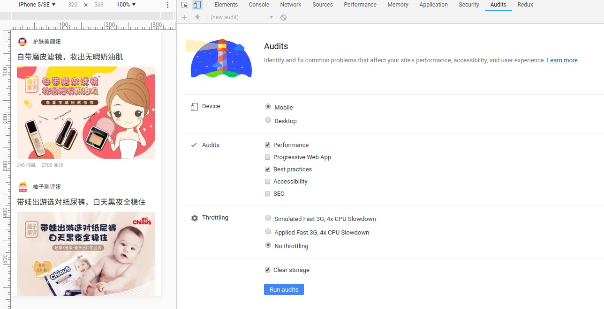


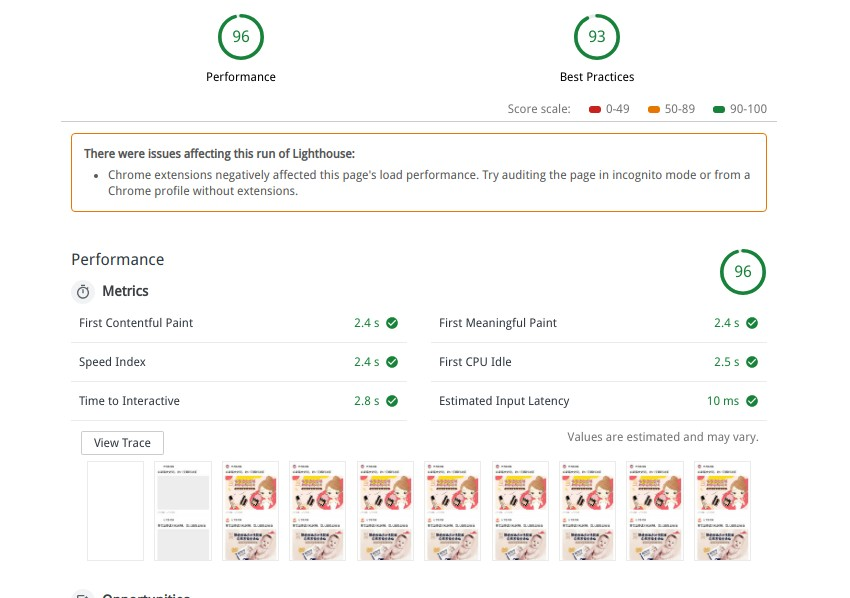


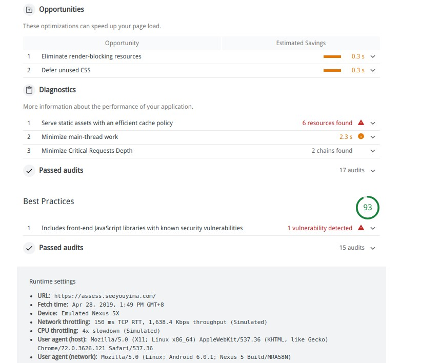


### WebpageTest

WebpageTest 可以在不同地理位置使用真实的设备测试性能，而且也可以运行 LightHouse。


**功能特性**

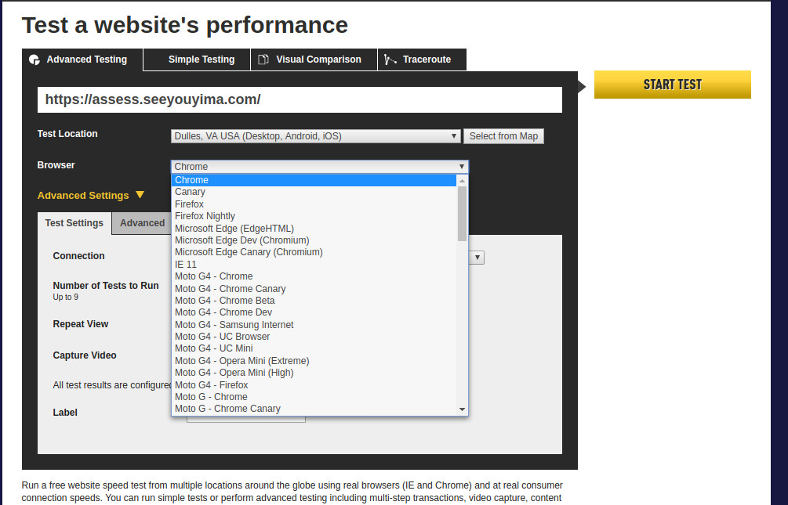


- 性能测试
- 网站对比
- 路由追踪


**测试条件**

- 地理位置：支持各个国家
- 客户端：真实的移动端设备
- 网络条件：3G、4G和有线网络等
- 打开方式：首次访问（清除了所有缓存），二次访问（在首次访问后关闭浏览器后再次打开访问）
- 多轮测试
- 视频录制
- LightHouse
Note:中国只有北京和香港，而且只有美国的 Dulles 支持的设备比较全，中国的北京和香港只能使用 Chrome 来模拟设备。


**测试结果**

- 等级评分
- 测试总结
- 测试明细
- 性能指标
- 资源分析
- 图片分析
- ...


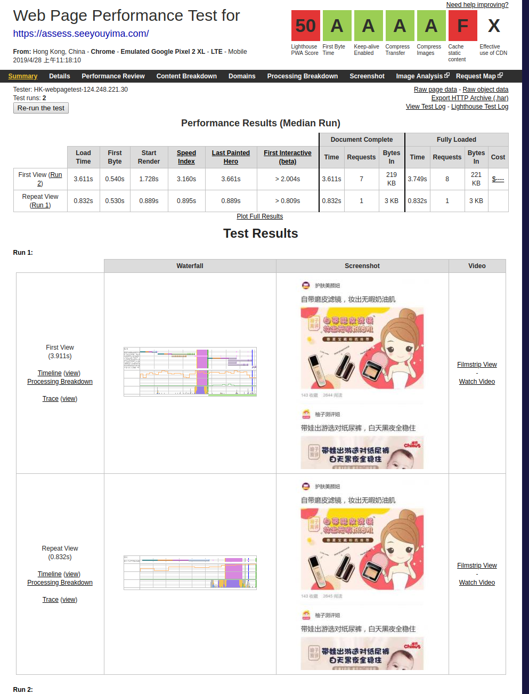


**幻灯片视图**

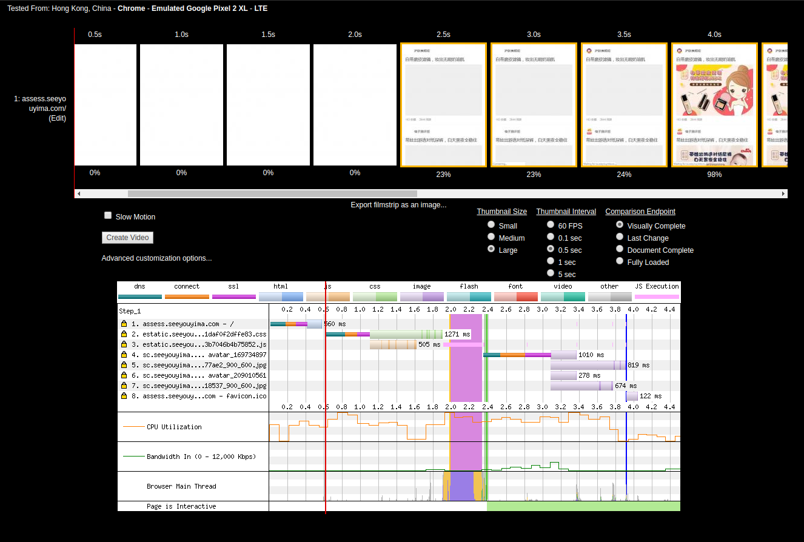


**录制视频**

<video src="./img/webpagetest.mp4" controls>


**测试明细**

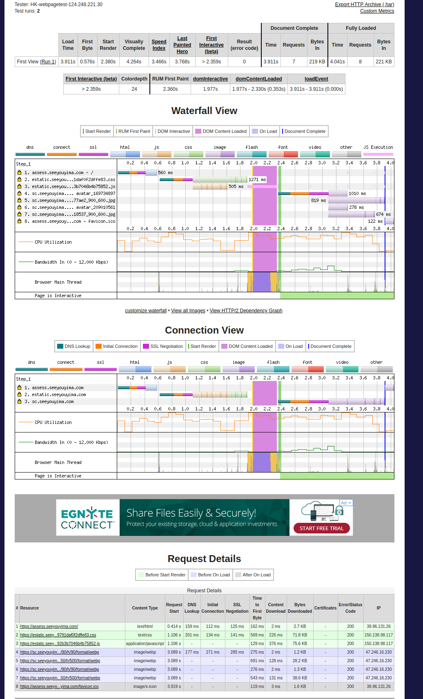


**图片分析**

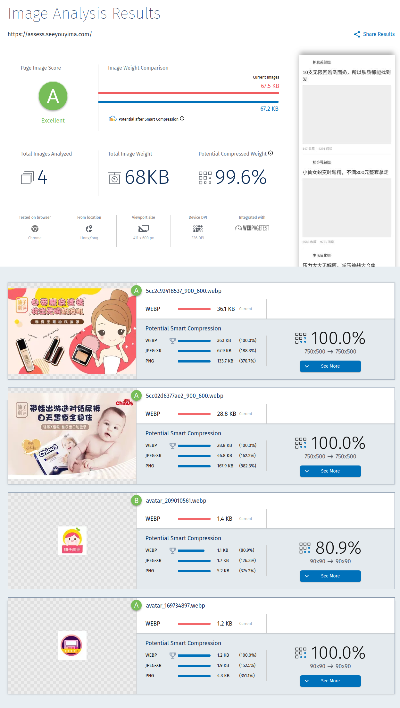


**路由追踪**

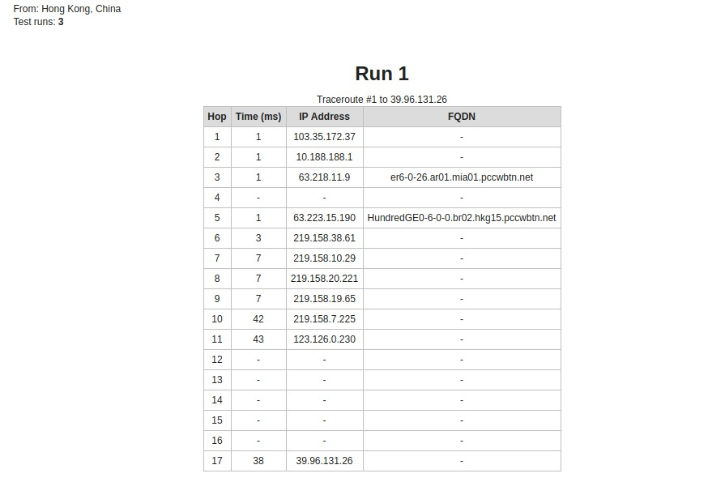


### PageSpeed Insights

PageSpeed Insights 能够针对移动设备和桌面设备生成网页的实际性能报告，并能够提供关于如何改进相应网页的建议。
Note:PageSpeed Insights 实际上就是 LightHouse 的一个在线版本，可以自动在移动设备和桌面设备测试性能，并给出两种设备上的测试结果。


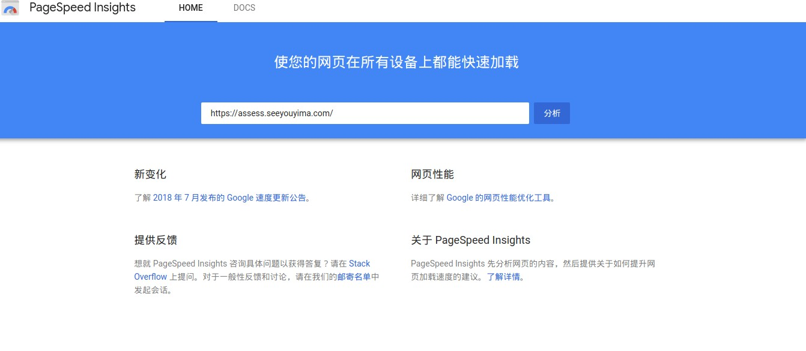


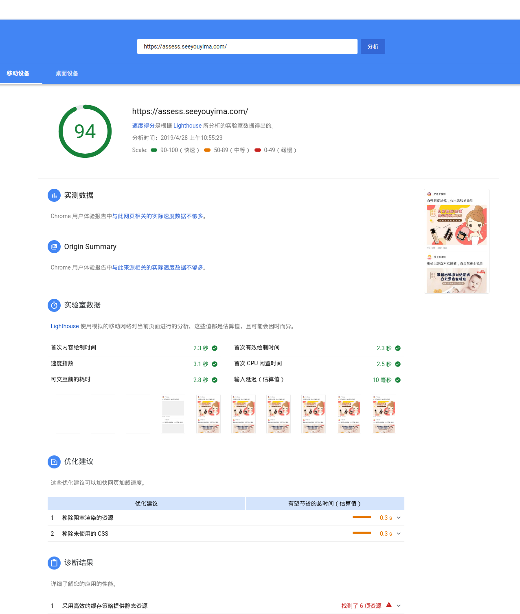


### TestMySite

TestMySite 可以诊断不同设备(3G / 4G)上的网页性能，而且提供了一些小工具来辅助分析性能。

- 竞品网站速度对比

    支持选择不同国家和不同网络情况

- 计算性能对收益的影响


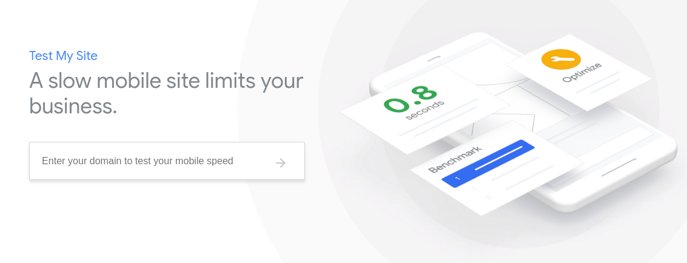


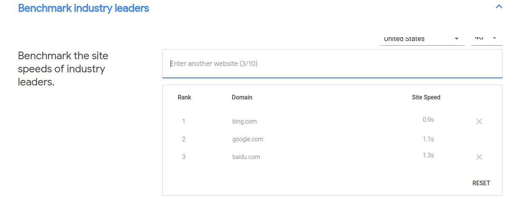


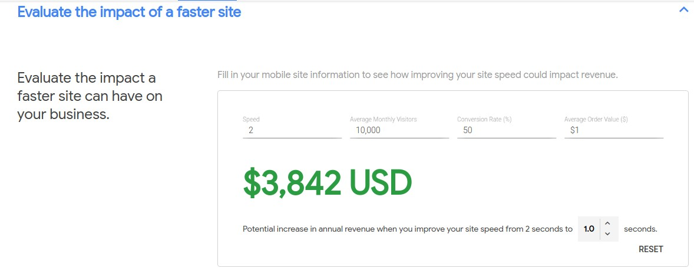


### Chrome Developer Tools

分析页面的运行情况，排查和调试性能瓶颈。
Note:Chrome 开发者工具提供了一系列的工具用于不同场景的调试，如网络审查，性能审查，内存分析等，这需要专门做 Chrome 开发者工具的使用教程。


### 总结


**开发人员**

1. 使用 LightHouse 模拟不同场景（设备性能和网络条件）下分析性能，并按指导意见进行优化；
2. 使用 WebPageTest 测试真实的移动端设备和网络情况来分析性能；
3. 使用 Chrome 开发者工具去调试解决性能为题。


**测试人员**

使用 PageSpeed Insights 测试性能
Note:可以考虑自己搭建 WebPageTest 服务器给测试人员使用。


**产品或其他**

使用 TestMySite 查看性能，对比竞品的网页加载速度，并计算性能对收益的影响。


### 思考

1. WebpageTest 可供国内测试的地理位置和设备太少，怎么解决该问题？
2. 使用 PageSpeed Insights 和 TestMySite 需要翻墙，而且它们提供的模拟环境不一定适用于我们？是否可以基于 WebpageTest 定制适用于我们自己的测试工具呢？
3. 开发者工具怎么使用 Chrome 开发者工具来分析性能，有哪些使用场景和小技巧？
4. 开发人员很少关心性能问题，怎样在统一在开发流程里加入性能自测这一项呢？
Note:https://github.com/thedaviddias/Front-End-Performance-Checklist


## 如何监控性能？
Note:[Assessing Loading Performance in Real Life with Navigation and Resource Timing](https://developers.google.com/web/fundamentals/performance/navigation-and-resource-timing/) / [Monitor and analyze the app](https://developers.google.com/web/fundamentals/performance/webpack/monitor-and-analyze)


### 有哪些东西可以统计？

1. 业务

    - 访问：PV、UV、页面来源、停留时长、到达深度
    - 点击：页面总点击量、人均点击量、点击热力图

2. 性能：白屏时间、首屏时间、可交互时间...
3. 错误：异常信息、异常所在文件、异常浏览器、异常堆栈信息...
Note:我们已经有业务和错误统计，但是还没有性能统计。


### 为什么要监控性能？

1. 可以使用单个指标来衡量用户体验；
2. 可以使用单个“代表用户”来衡量用户体验；
3. 我（开发人员）自己访问网站时加载速度很快，我的用户也行。
4. ...
Note:[以用户为中心的性能指标](https://developers.google.com/web/fundamentals/performance/user-centric-performance-metrics#_1)，我们现在常常听到人们这样说：我已经测试我的应用，加载时间为 X.XX 秒。但实际上，应用的加载时间会因为用户不同而有很大的变化，具体取决于用户的设备功能以及网络状况，以单个数字的形式呈现加载时间忽略了遭遇过长加载时间的用户。而且，加载并非单一的时刻，而是一种任何单一指标都无法全面衡量的体验。 在加载过程中，有多个时刻都会影响到用户对速度的感知，如果只关注其中某个时刻，就可能会遗漏其余时间内用户感受到的不良体验。


Note:X 轴上的数字显示加载时间，而 Y 轴上条的高度显示体验到特定时间段中加载时间的用户相对数量。 正如此图表所示，虽然最大的用户群体验到的加载时间不到 1 或 2 秒，但仍有很多用户体验到相当长的加载时间。


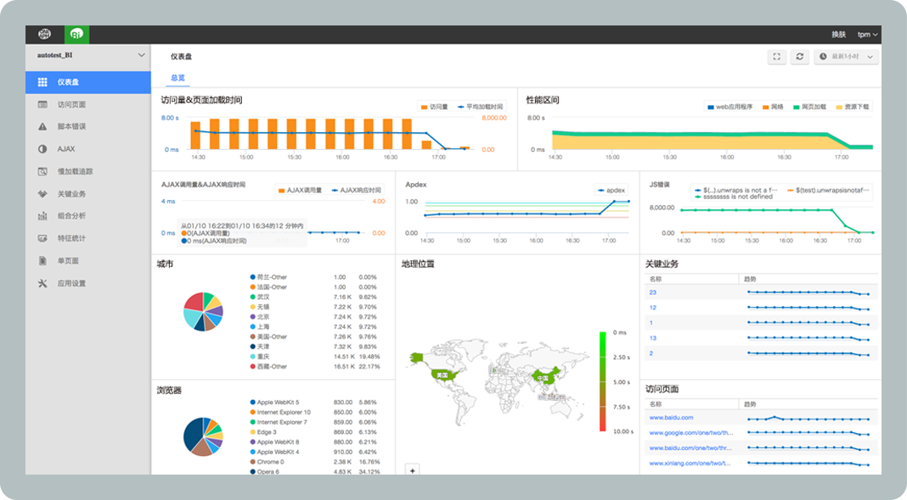


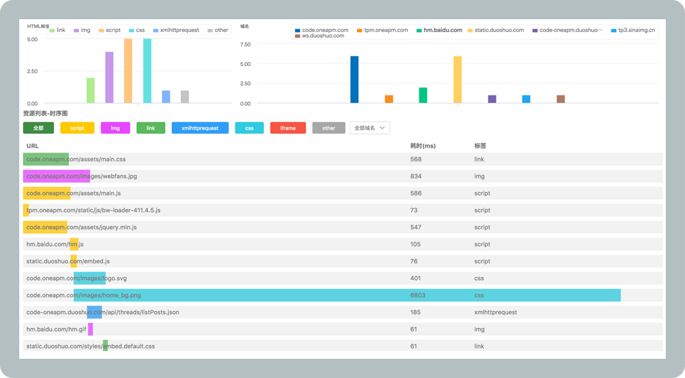


### 怎么实现监控系统？


W3C 制定了跟浏览器性能相关的 Performance API，可以检测以下几个维度的性能数据：

- 导航
- 资源
- 绘制
- 帧率
- CPU 空闲
- 自定义


#### 导航


Note:导航加载指的是浏览器 HTML 文档加载时间。


**使用方式**

1. [`Performance​Timing`](https://developer.mozilla.org/en-US/docs/Web/API/PerformanceTiming)：第一版接口，大部分浏览器已经支持，规范文档参考 [Navigation Timing](https://www.w3.org/TR/navigation-timing/#sec-navigation-timing-interface)
2. [`PerformanceNavigationTiming`](https://developer.mozilla.org/en-US/docs/Web/API/PerformanceNavigationTiming)：第二版接口，已经不少浏览器支持，规范文档参考 [Navigation Timing Level 2](https://w3c.github.io/navigation-timing/#sec-PerformanceNavigationTiming)

Note:目前，W3C 已经制定了两个版本关于导航加载时长获取接口的规范。


`Performance​Timing`

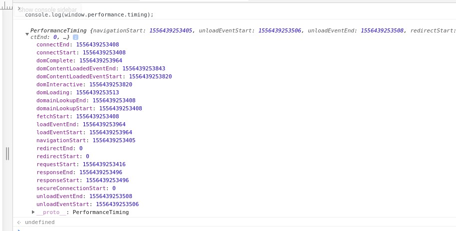

Note:`Performance​Timing` 的相关数据可以直接访问 `window.performance.timing` 获取，浏览器在每个 HTML 页面上自动实例化一个 `PerformanceTiming` 对象并赋值给 `window.performance.timing`，包含一系列如上图所示的导航加载时间数据。


`PerformanceNavigationTiming`

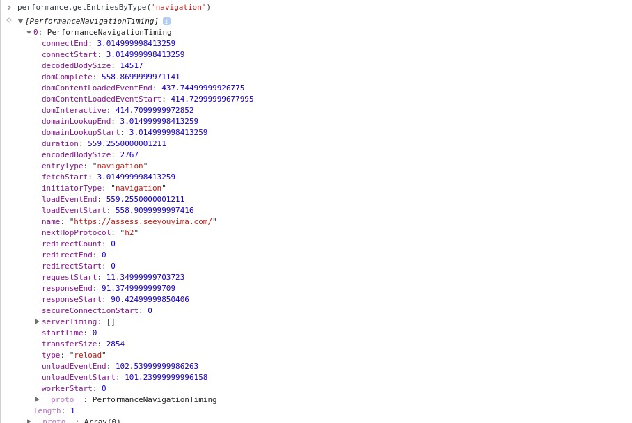

Note:`PerformanceNavigationTiming` 的相关数据可以通过 `window.performance` 的方法 `getEntries`、`getEntriesByName` 和 `getEntriesByType` 来获取。这几个接口返回一个数组，该数组包含各种性能指标数据，其中包含 `PerformanceNavigationTiming` 的实例，该实例所包含的性能数据参见上图。这两个版本的导航性能接口能获取的数据维度基本一致，都包含该上图所示的相关节点数据。但是，他们存在一个主要的不同点在于 `Performance​Timing` 使用传统的时间戳来给各个节点属性赋值，而 `PerformanceNavigationTiming` 采用了高精度时间。


#### 资源加载

Performance 接口提供了获取网页资源加载相关的性能数据，这些资源包括：`XMLHttpRequest`、`<SVG>`、图片、样式和脚本等。有关资源加载的性能数据可以通过`window.performance` 的方法 `getEntries`、`getEntriesByName` 和 `getEntriesByType` 来获取，此外，也可以使用 `Performance​Observer` 来监听获取。


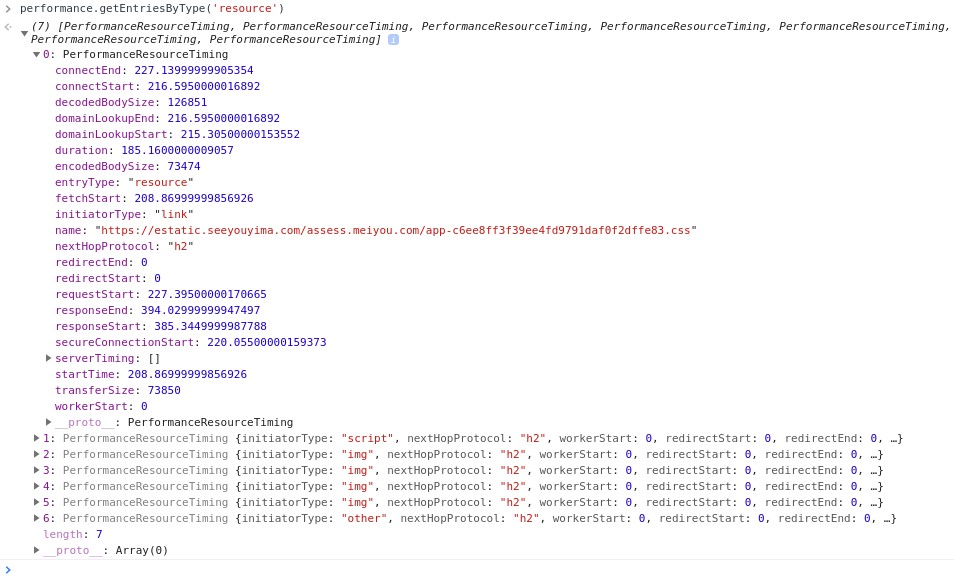


### 首次绘制 / 首次内容绘制

首次绘制是指浏览器将构造好的渲染树渲染成屏幕像素的时机点，而首次内容绘制是指具体内容，如文本和图片等，渲染到屏幕上的时间。有关绘制时间的性能数据都存储在 `Performance​Paint​Timing` 对象示例中。


1. `window.performance.getEntriesByType('paint')`
2. `window.performance.getEntriesByName('first-paint')` / `window.performance.getEntriesByName('first-contentful-paint')`
3. `window.performance.getEntries()`：在返回的数组中过滤出相关数据


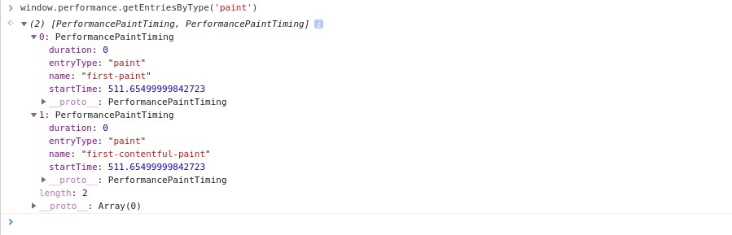


#### 帧率

帧率相关的性能数据被封装在 `Performance​Paint​Timing` 对象实例中，可以通过以下方式获取：

```
window.performance.getEntriesByType('frame');
window.performance.getEntries();
```

Note:截止到目前（201904），帧率相关的性能指标数据接口还没有相关浏览器支持，需要监测帧率可以通过 `requestAnimationframe` 来模拟实现。


#### 耗时较长的任务

`Performance​Long​Task​Timing` 封装了耗时较长的任务的性能数据，可以通过以下方式获取：

```js
new PerformanceObserver(function (performance​Long​Task​Timing) {
  // 事件回调
}).observe({ entryTypes: ['longtask'] })
```

Note:目前这个 API 还在实验当中，没有得到浏览器的广泛支持，目前只有 Chrome 和安卓支持。但类似帧率，可以使用 `requestAnimationframe` 来模拟实现。


#### 自定义性能测试

Performance 提供了一套基于高精度时间的性能测试接口。


- [`performance.mark`](https://developer.mozilla.org/en-US/docs/Web/API/Performance/mark)
- [`performance.measure`](https://developer.mozilla.org/en-US/docs/Web/API/Performance/measure)
- [`PerformanceMark`](https://developer.mozilla.org/en-US/docs/Web/API/PerformanceMark)
- [`Performance​Measure`](https://developer.mozilla.org/en-US/docs/Web/API/PerformanceMeasure)


#### 查询性能数据

[`PerformanceEntry`](https://developer.mozilla.org/en-US/docs/Web/API/PerformanceEntry) 代表了各类性能测量的指标。

- `PerformanceMark`
- `PerformanceMeasure`
- `PerformanceFrameTiming`
- `PerformanceNavigationTiming`
- `PerformanceResourceTiming`
- `PerformancePaintTiming`
- `Performance​Long​Task​Timing`
- ...


- `performance.getEntries`：查询全部
- `performance.getEntriesByType`：按类型查找，如：导航是 `'navigation'`,资源是 `'resource'`
- `performance.getEntriesByName`：每个类型下可能有不同名称的性能指标，例如：绘制类型是 `paint`，分为 `'first-paint'` 和 `'first-contentful-paint'`


#### 监听性能数据

`Performance​Observer` 用于监听性能指标的测量事件。

```js
function perf_observer(list, observer) { 
   // Process the "measure" event 
} 
var observer2 = new PerformanceObserver(perf_observer); 
observer2.observe({ entryTypes: ["measure"] });
```


#### 清除性能缓存

由于在一个网页应用中资源的数量是不确定的，一个复杂的应用可能包含成败上千的资源请求，浏览器不可能全部存储这些资源加载的性能数据。所以 Performance 还提供了以下几个相关的方法来控制缓存：


- [`performance.clearResourceTimings`](https://developer.mozilla.org/en-US/docs/Web/API/Performance/clearResourceTimings)
- [`performance.onresourcetimingbufferfull`](https://developer.mozilla.org/en-US/docs/Web/API/Performance/onresourcetimingbufferfull)
- [`performance.setResourceTimingBufferSize`](https://developer.mozilla.org/en-US/docs/Web/API/Performance/setResourceTimingBufferSize)
- [`performance.clearMarks`](https://developer.mozilla.org/en-US/docs/Web/API/Performance/clearMarks)
- [`performance.clearMeasures`](https://developer.mozilla.org/en-US/docs/Web/API/Performance/clearMeasures)


#### 高精度时间

- [`performance.now`](https://developer.mozilla.org/en-US/docs/Web/API/Performance/now)
- [`performance.timeOrigin`](https://developer.mozilla.org/en-US/docs/Web/API/Performance/timeOrigin)：返回一个高精度的时间戳，例如：`1518354643295.86`
- [`performance.toJSON`](https://developer.mozilla.org/en-US/docs/Web/API/Performance/toJSON)


#### 兼容性

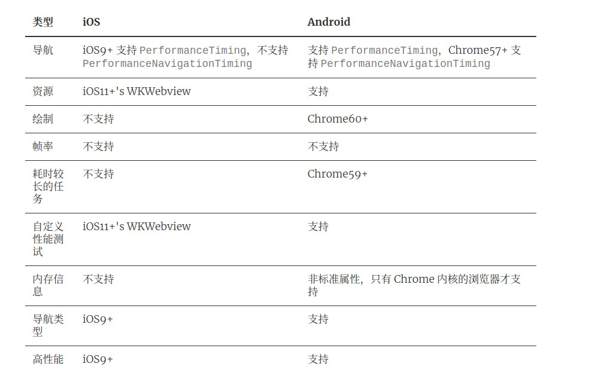


## TODO

1. 性能优化规范
2. 性能测试工具
2. 性能监控平台
