# `<script>`

Note:今天主题是 HTML 标签 script，用于嵌入或引用可执行脚本，这是我们前端程序猿在编写前端应用时的入口，用起来很简单，但是在深入了解后，script 标签受到各种历史遗留因素影响变得又不简单。


1. 基础用法
2. ES Module
3. 跨域配置
4. SRI 策略
5. 加载机制

Note:下面会帮助大家重新回顾下 script 最基本的用法，学习如何配置使得 script 支持 ES Module，学习脚本跨域配置、SRI 策略，以及 script 的加载机制。


## 基础用法


1. 外部脚本

```html
<script src="javascript.js"></script>
```

2. 内联脚本

```html
<script>
    // ...
</script>
```

Note: `<script>` 一般就两种用法，参考[基础用法示例](./examples/basic-usage)


### 更多脚本类型

- JavaScript MIME

    ```html
    <script src="javascript.js"></script>
    <!-- 等价于 -->
    <script src="javascript.js" type="text/javascript"></script>
    ```

- module

    ```html
    <script src="javascript.js" type="module"></script>
    ```

- 其他任意 MIME

    ```html
    <script id="comment-template" type="text/x-lodash-template">
      <div class="comment">
        <%= commenter %>
      </div>
    </script>
    ```

Note:`<script>` 通过 `type` 属性是用来标识[脚本内容类型](https://developer.mozilla.org/en-US/docs/Web/HTTP/Basics_of_HTTP/MIME_types#textjavascript)，一般分为以下三种类型：JavaScript MIME、module，其他任意 MIME。在 H5 普及之前（HTML4），我们经常会看到 `<script>` 配有支持配置 `type="text/javascript"`。但在 H5 规范中已经呼吁开发人员取消了 `type="text/javascript"`（默认不配就是 JavaScript 类型）。ps：在早期的浏览器中，支持 [MIME 嗅探标准](https://mimesniff.spec.whatwg.org/)（定义了 script 的内容类型，以及如何处理），有效的 JavaScript MIME 类型可以是 `text/livescript`、`application/ecmascript`、`text/javascript1.0` 等。但现在这些类型已经被 [RFC 4329](https://tools.ietf.org/html/rfc4329) 废弃了，只允许使用 `text/javascript`。module 类型将代码作为 JavaScript 模块处理。其他 MIEME 类型脚本内嵌（`src` 属性会被忽略）在 `<script>` 中的内容作为数据数据块使用，浏览器不会解析执行该标签。


## ES Module

Note: 最新的浏览器大部分都默认支持模块化语法，我们需要做的只是在 script 标签元素上声明 `type=module` 就可以了。


## 启用模块化

```html
<script type="module" src="main.js"></script>
<!-- 或 -->
<script type="module">
  import './main.js';
</script>
```

```js
// main.js
import utils from './utils.js';

utils.alert(`
  JavaScript modules work in this browser:
  https://blog.whatwg.org/js-modules
`);
```

```js
// utils.js
export default {
  alert: (msg)=> {
    alert(msg);
  }
};
```


### 一些常见问题


`import` 模块支持相对路径、绝对路径和 URL，不支持直接的模块名（类似 Nodejs 第三方模块）

- `./`
- `../`
- `/`
- URL


没有配置 `type="module"`，但脚本里使用了 ES Module 时会报语法错误

```
Uncaught SyntaxError: Unexpected identifier
```


对于不支持 `type="module"` 的浏览器遇到这样的 script 标签时，不会解析执行。为了解决兼容性问题，script 引入了属性 `nomodule`，带有该属性的 script 标签会被支持 `module` 的浏览器忽略。

```html
<script type="module" src="module.js"></script>
<script nomodule src="fallback.js"></script>
```


module 类型的 script 默认是开启 defer（脚本会推迟到 HTML 解析完成后执行），即使是内联的 module script 脚本，也会被 defer（普通的内联脚本是不支持 defer 的）。


module script 支持 async（在解析 HTML 的同时并行下载，下载完成后立即解析执行）


module script 只会执行一次

Note:如果你知道 ES modules，你就应该知道，modules 可以 import 多次，但只会执行一次。这种原则同样适用于 HTML 里的 script modules，一个确定的 URL 上的 module script 在一个页面上只会执行一次。


CORS 跨域资源共享限制

Note:跟普通的 scripts 不同, module scripts (以及它们的 imports 行为) 受 CORS 跨域资源共享限制。也就是说，跨域的 module scripts 必须返回带有有效 Access-Control-Allow-Origin: * 的 CORS 头信息。


没有凭证信息(credentials)

Note:当请求在同一安全域下，大多数的 CORS-based APIs 都会发送凭证信息 (cookies 等)，但 fetch() 和 module scripts 例外 – 它们并不发送凭证信息，除非我们要求它们。我们可以通过添加 crossorigin 属性来让同源 module 脚本携带凭证信息，如果你也想让非同源 module 脚本也携带凭证信息，使用 crossorigin="use-credentials" 属性。需要注意的是，非同源脚本需要具有 `Access-Control-Allow-Credentials: true` 头信息。


## 跨域配置


`<script>` 有一个 crossorigin 属性，用来控制跨域脚本请求是否会携带凭据信息（cookies、客户端 SSL 证书或 HTTP 认证交换用户凭据）。

Note: 这个属性本身是 CORS 的规范，不只是 script 标签，image、video 等标签也支持。此外脚本标签设置了该属性后，会强制开启 CORS 标准校验（检查跨域资源请求的响应头是否设置了正确的响应头）。


### 是否携带凭据？

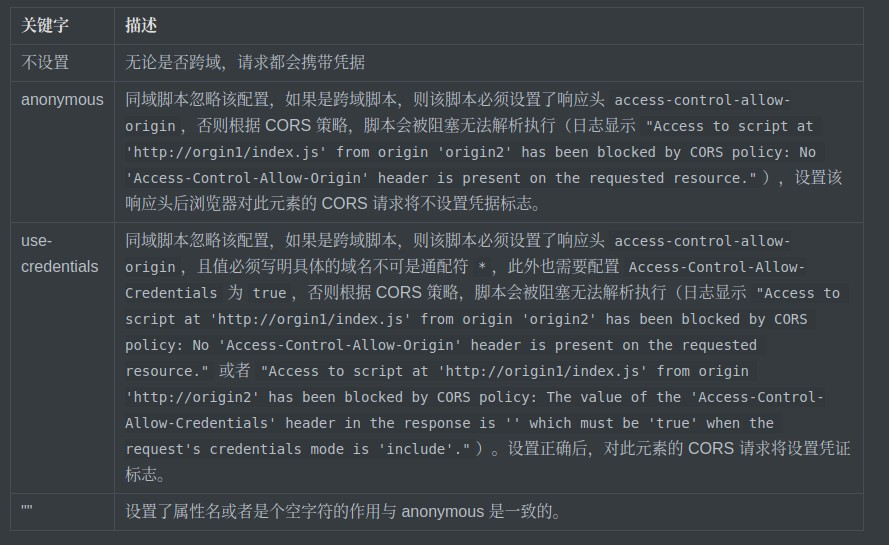

Note: 同域脚本有没有配置 crossorigin 是没有任何影响的，而跨域脚本标签没有配置 crossorigin 时会兼容旧浏览器的实现（不受 CORS 限制，即要求跨域请求必须设置 CORS 相关的响应头）。但跨域脚本一旦设置 crossorgin 就必须遵从 CORS 标准。


疑问：既然不设置 anonymous，跨域脚本请求都会携带凭据，为什么还需要 `use-credentials`？ —— 见下文的”全局错误捕获“


### 全局错误捕获

[window.onerror](https://developer.mozilla.org/en-US/docs/Web/API/GlobalEventHandlers/onerror) 可以捕获 JavaScript 运行时错误和一些资源的加载失败错误，为了避免[信息泄露](https://bugzilla.mozilla.org/show_bug.cgi?id=363897)（[I know if you're logged-in, anywhere](https://blog.jeremiahgrossman.com/2006/12/i-know-if-youre-logged-in-anywhere.html)），浏览器默认不支持捕获跨域脚本运行错误的明细信息（只能拿到一个错误信息 `"Script error."`）。


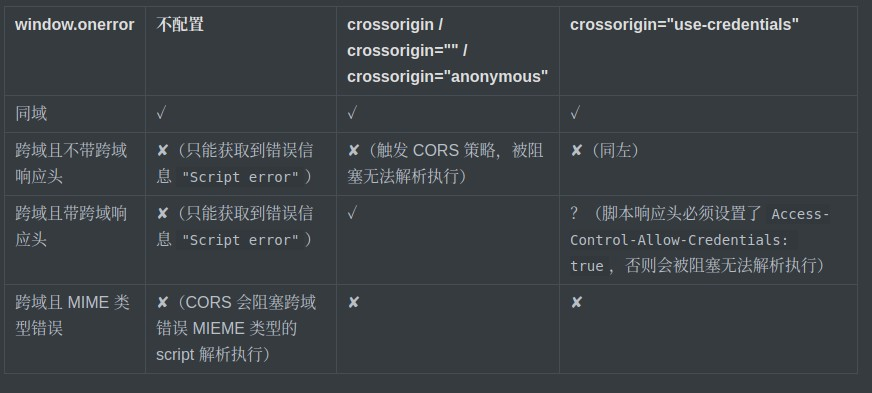

Note:通过理解 crossorigin 的作用机制可以明白，设置 crossorigin 可以禁止请求脚本的时候携带凭据信息，服务端也就不会根据凭据信息返回用户相关的信息，避免了信息泄露，window.onerror 也就允许捕获错误明细信息了。


总结：现在的浏览器默认不能获取到跨域脚本的明细信息，并且错误类型的 MIME 脚本是不允许加载执行的。为了捕获跨域脚本的错误明细信息，需要达成以下两个条件：

1. 跨域脚本的服务器设置了跨域响应头
2. 跨域脚本 script 标签设置了 crossorigin 属性

Note: [crossorgin 测试示例](./examples/cross-origin)


## SRI 策略


SRI（Subresource Integrity）是允许浏览器检查其获得的资源（例如从 CDN 获得的）是否被篡改的一项安全特性。


### 为什么

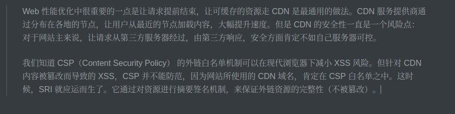


### 怎么使用

```html
<script crossorigin="anonymous" integrity="sha512-BlCvumXWTvpASEdhCGiahDUDf7Bwb8QXA2XnnSnqJ9QafxcNcrNYUNYS2wXmd3nEpO//+zlZa9DSV9zmu5MqRg==" type="application/javascript" src="https://github.githubassets.com/assets/compat-bootstrap-90c0ace0.js"></script>
```

Note: 要使用 SRI，只需要在原有的标签里增加 integrity 属性即可，这个属性的签名算法支持 sha256、sha384 和 sha512，签名算法和摘要签名内容用 - 分隔。浏览器拿到资源内容之后，会使用 integrity 所指定的签名算法计算结果，并与 integrity 提供的摘要签名比对，如果二者不一致，就不会执行这个资源。webpack 可以使用插件 [webpack-subresource-integrity](https://github.com/waysact/webpack-subresource-integrity) 自动生成 integrity。


### 局限性

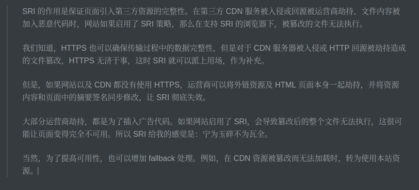


## 加载机制


### 回顾 HTML 解析流程

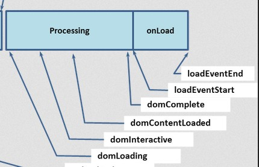


- [document.readyState](https://developer.mozilla.org/en-US/docs/Web/API/Document/readyState)

    - loading：正在解析 HTML 文档；
    - interactive：HTML 文档已经被解析完成，但是 img 等子资源仍在加载中；
    - complete：所有子资源已经加载完成，即将触发 load 事件。

- [DOMContentLoaded](https://developer.mozilla.org/en-US/docs/Web/API/Document/DOMContentLoaded_event)
- [load](https://developer.mozilla.org/en-US/docs/Web/API/Window/load_event)

Note:readyState 变为 interactive 之后页面才能交互吗？ —— 否


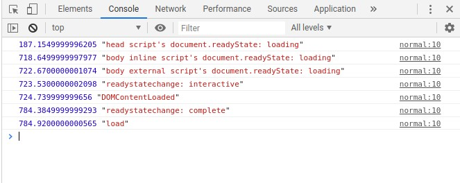


1. [1] initial readyState:loading
2. [2] readyState:interactive
3. [2] DOMContentLoaded
6. [3] img onload
5. [3] readyState:complete
7. [3] window onload

Note:根据测试示例 [process-normal](./examples/process/normal.html) 结果分析可知，整个流程主要分为三个阶段：1）HTML 解析中；2）HTML 解析完成，处于加载子资源中；3）子资源加载完成，HTML 完成加载


### script 加载、解析和执行流程

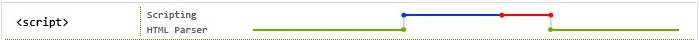


```html
<script src="1.js"></script>
<script src="2.js"></script>
```

Note:上面这段 HTML 是最简单的脚本引入方式，浏览器会在解析 HTML 时加载这两个脚本，一旦下载完毕，会按照它们的顺序执行。在 "1.js" 执行完毕前(或执行失败) "2.js" 都不会执行，而 "1.js" 也不会执行直到在它前面的脚本或样式表执行完毕，依次类推。HTML 解析要等脚本加载解析执行完成后才算结束，也就是说 `document.readyState` 变为 interactive 和 DOMContentLoaed 事件都会在 script 脚本引入的 JS 加载执行后才会触发。虽然脚本引入写起来很简单，浏览器能够正确的加载执行脚本。不幸的是，在这一切发生的过程中，浏览器会阻塞 HTML 解析。这么做的原因在于早期的 DOM API 允许向解析器正在处理的内容追加字符串，例如 document.write。这也就是为什么推荐将脚本元素放置到文档底部，因为它会阻塞尽可能少的内容。不过它导致另外一个问题，那就是浏览器在将整个文档下载完毕前都不会发现脚本，而到那时，浏览器已经开始下载其他像 CSS，图片或 iframe 等资源了。现代浏览器会在 HTML 被 script 阻塞时在后台继续扫描或解析文档，并下载它可能需要的额外资源(js，图片，css 等等)，并且现代浏览器会智能的为 JavaScript 提供比图片更高的优先级，但解析渲染终会被阻塞。参考测试示例 [脚本对 HTML 解析的影响]('./examples/script-block/html-parse)，观察脚本对 HTML 解析的影响。如下图是 Chrome 在测试示例中的网络加载截图，Chrome 会预解析 HTML 查找优先级更高的 script 标签，并下载关联的资源。


**Chrome**

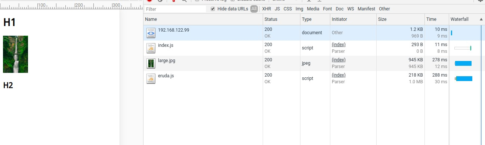


**IE**

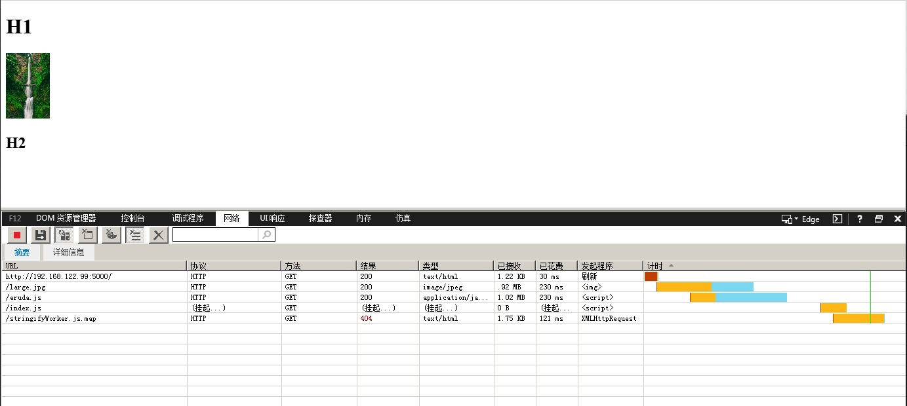

Note:遗憾的是，在 IE 浏览器中并没有做这些优化（即使是最新版本的 IE 11 也没有）。在 IE 浏览器调试过程中发现，IE 浏览器解析 HTML 被 script 阻塞时并不会在后台继续扫描或解析文档。下图是上面测试示例的网络加载截图，从子资源的加载顺序来看，会按外部资源在 HTML 中的顺序下载，并且 HTML 解析到脚本时会阻塞后续脚本的加载。


**Chrome Block**

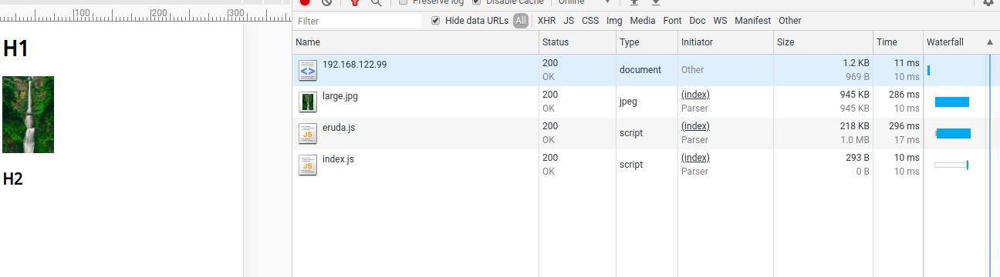

Note:即使是现代浏览器也存在不完全优化的情况，例如下面的测试示例截图中，同样的代码 Chrome 偶尔会优先加载图片。此外，在测试[脚本与其他资源的加载优先级对比](./examples/script-block/script-priority)时，IE 等旧浏览器不会优先加载脚本，而现代浏览器虽然有调高脚本的加载优先级，但是也不完全是优先加载脚本的。


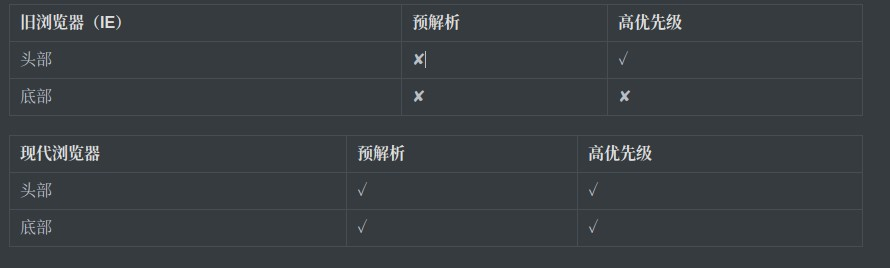

Note:虽然现代浏览器为我们做了很多优化工作，但是我们可以做的更好。


### 延迟 script 解析执行

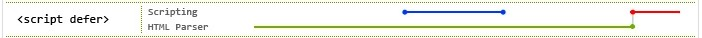

Note:感谢 IE！微软意识到了这些性能问题，于是在 Internet Explorer 4 中引入了 “defer”。该属性被采纳到 HTML4 里并出现在了其他浏览器中。 —— [defer attribute for external scripts](https://caniuse.com/#feat=script-defer)


```html
<head>
  <!-- ... -->
  <script defer src="1.js"></script>
  <script defer src="2.js"></script>
</head>
```

Note:在上面的例子中，浏览器会并行下载两个脚本，并在 DOMContentLoaded 触发前(按顺序)执行它们。需要注意的是 “defer” 对于动态添加或是没有 “src” 属性的脚本不生效。否则，延迟的脚本会在文档解析完毕后，按照它们的添加顺序执行。


**成也 IE，败也 IE**

1.js

```js
console.log('1');
document.getElementsByTagName('p')[0].innerHTML = 'Changing some content';
console.log('2');
```

2.js

```js
console.log('3');
```

Note:常言道：有所得，必有所失。在 IE4-9 下存在一个讨厌的 bug 会导致脚本不按照期望顺序执行。假设页面中有一个 p 元素，期望的日志顺序是 [1, 2, 3]，但在 IE9 中得到的却是 [1, 3, 2]。特定的 DOM 操作会导致 IE 暂停执行当前脚本，而在恢复执行前会去执行其他挂起的脚本。


### 异步加载执行脚本

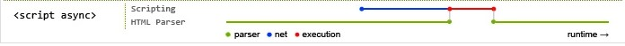

Note: HTML5 提供了一个新属性，“async”，它会假设你并不准备使用 document.write，当也不需要等到文档解析完毕后才执行。


```html
<head>
  <!-- ... -->
  <script async src="1.js"></script>
  <script async src="2.js"></script>
</head>
```

Note: 浏览器会并行下载两个脚本并尽快执行它们.不过，因为它们会尽可能快的执行，“2.js” 就有可能先于 “1.js” 而执行。如果它们互不依赖倒还好，比如说 “1.js” 是一个用于记录访问的脚本，它不会影响 “2.js”。但要是 “1.js” 是 jQuery 的一个 CDN 拷贝，而 “2.js” 依赖于它，那你的页面就可能会被报错信息淹没。


- RequireJS
- LabJS
- 其他

Note: 为了解决模块依赖关系，诞生了一批前端脚本加载库，例如：Requirejs，Labjs，Seajs 等等。RequireJS 将它们包裹在一个回调函数中，这样库就可以按照正确的顺序调用它们。LabJS 使用了奇特的 hack，脚本会使用一个错误的 mime 类型，比如 `<script type="script/cache" src="...">`。一旦所有脚本加载完毕，它们会使用正确的类型重新添加一遍，希望浏览器能够使用缓存获取它们并立即按顺序执行。这一 hack 依赖于一个约定俗成却并非规范的浏览器行为，但是 HTML5 规定了浏览器不去下载错误类型的脚本，该 hack 便失效了。其他方案使用 XHR 来并行下载然后按照顺序调用 eval()，这个方法不适用于跨域脚本，除非它们拥有 CORS 头并且浏览器支持该设置。可是，脚本加载器自身就有性能问题，你必须要等到库的 JavaScript 下载并解析完毕后才能开始下载其他它管理的脚本。还有，我们如何去加载脚本加载器呢？庆幸的是，现代的前端项目打包工具 webpack 已经帮助我们解决了这个问题，由 webpack 将项目的代码拆分打包成几个文件，这几个文件的加载顺序是没有依赖关系的。


### iOS Safari 渲染被阻塞

Note: iOS Safari 的 HTML 不仅仅被脚本阻塞解析，还会被脚本渲染。


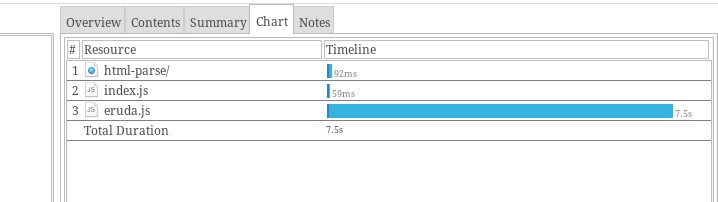


<video src="./img/script-block-ios-render-block.mp4" style="width: 90;height: 160"></video>

Note: 在部分场景下 iOS Safari 又不会被脚本阻塞渲染，例如在 HTML 中插入一张图片之类的。为什么 iOS Safari 会这里处理？是 bug，还是特意为之？此外，其他现代浏览实际在有些情况下也是会阻塞渲染的，参见[示例](./examples/performance)。


### 基于 DOM API 加载脚本


```js
[
  '1.js',
  '2.js'
].forEach(function(src) {
  var script = document.createElement('script');
  script.src = src;
  document.head.appendChild(script);
});
```

Note:动态创建并添加进文档中的脚本默认就是异步的，它们并不阻塞渲染，并且下载结束后会立即执行，这表示它们的执行顺序不固定。不过，我们可以将它们明确设置为非异步。


```js
[
  '1.js',
  '2.js'
].forEach(function(src) {
  var script = document.createElement('script');
  script.src = src;
  script.async = false;
  document.head.appendChild(script);
});
```

Note: 这个方法为我们的脚本赋予了普通 HTML 无法达到的混合行为。由于明确设置为非异步，脚本被加入一个执行队列中，也就是在第一个普通 HTML 例子中同样的队列。然而，因为脚本是动态创建的，它们会在文档解析过程中被执行，因此脚本的下载不会阻塞页面渲染。上面那段代码需要以行内形式放到页面头部中，这样就可以在不干扰页面渲染的情况下快速下载脚本，并按照指定顺序执行。这种加载脚本的方式被所有支持 [async 属性的浏览器所支持](https://caniuse.com/#feat=script-async)。


疑问：这就是加载脚本最快速的方式吗？

Note:如果你需要动态决定加载哪些脚本，那么的确，这是最快的方式，否则的话就不一定了。在上面的例子中，浏览器需要解析并执行脚本来决定应该加载哪些脚本。这样一来，预加载扫描器(preload scanner)就不会发现它们。浏览器使用这些扫描器来发现即将要使用的资源，或是在解析器被其他资源阻塞时来发现新资源。可以使用 [Resource Hints: preload](https://caniuse.com/#feat=link-rel-preload) 来告诉浏览器预加载脚本：


```html
<link rel="preload" href="1.js" as="script">
<link rel="preload" href="2.js" as="script">
```


<video src="./img/script-block-ios-render-block-fine.mp4" style="width: 90;height: 160"></video>

Note: 上面是 iOS Safari 经过该方案优化后的结果：


### 最佳实践

完美的场景就是多个脚本能立即下载，并且不会阻塞解析和渲染，一旦下载完毕就会按照添加的顺序执行。


#### 兼容性最好且最简单的方式

把它放在文档底部

```html
<script src="1.js"></script>
<script src="2.js"></script>
```


如果你对性能要求十分高，并且不在乎一点复杂性与重复的话，可以将上面介绍的几个技巧组合起来。


1 preload

```html
<link rel="subresource" href="1.js">
<link rel="subresource" href="2.js">
```


2 在文档头部中使用行内 JavaScript 来加载脚本，使用 async=false，备选方案是基于 IE 的 readystate 脚本加载，或者选择延迟加载。

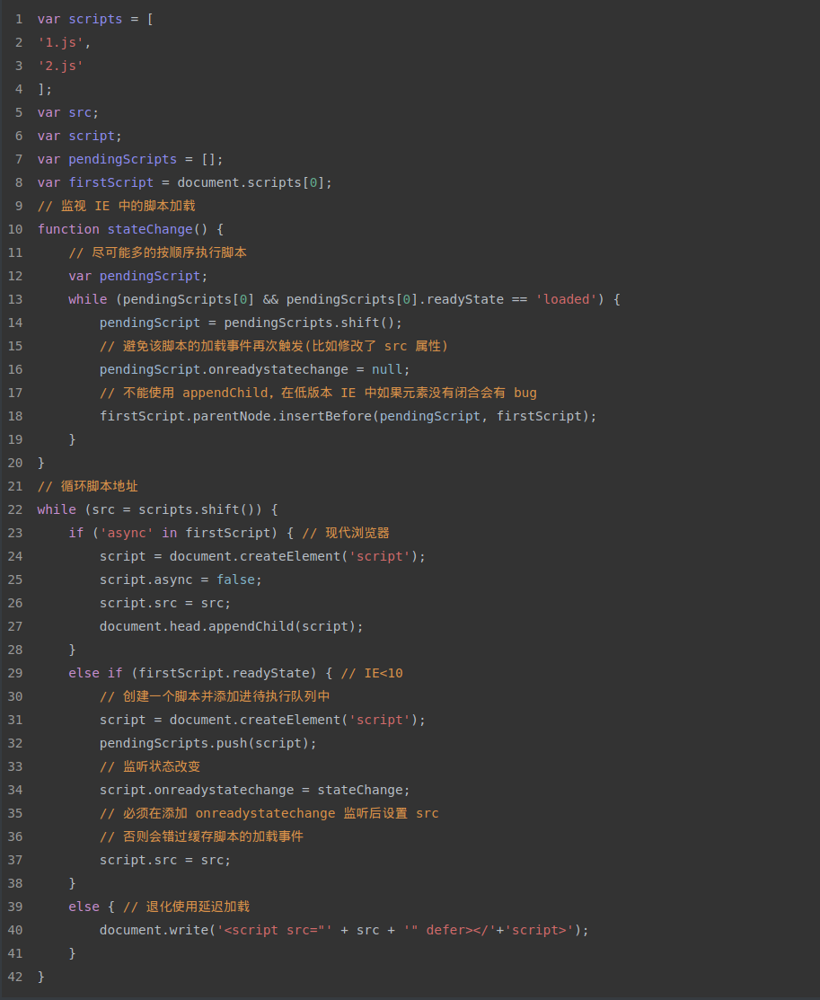


## 其他

- nonce：每次HTTP回应给出一个授权token，页面内嵌脚本必须有这个token，才会执行
- referrerpolicy：获取脚本的时候请求是否带 referrer

Note: 这些是属于[内容安全策略](http://www.ruanyifeng.com/blog/2016/09/csp.html)部分的知识。


## 兼容性

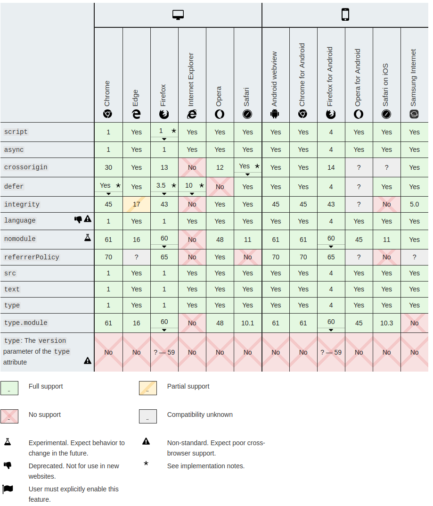


## 总结


1. script 基础用法，type 的作用
2. ES Module 写法
3. 跨域脚本配置
4. SRI 策略
5. 加载机制
