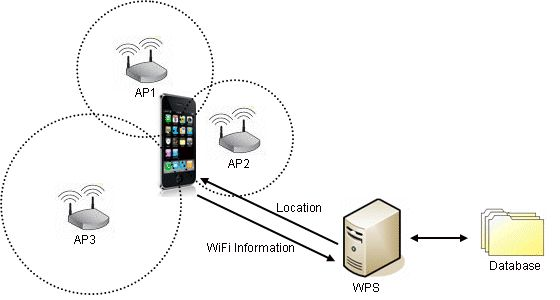
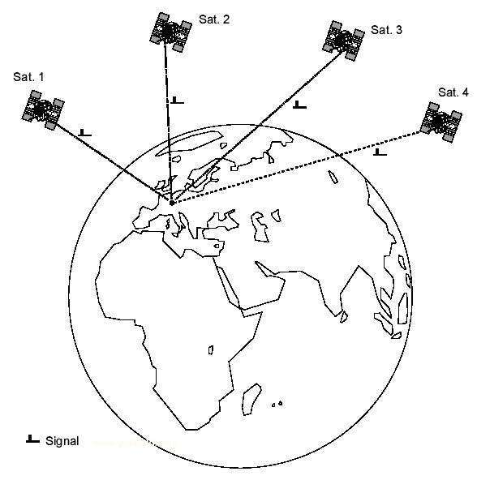
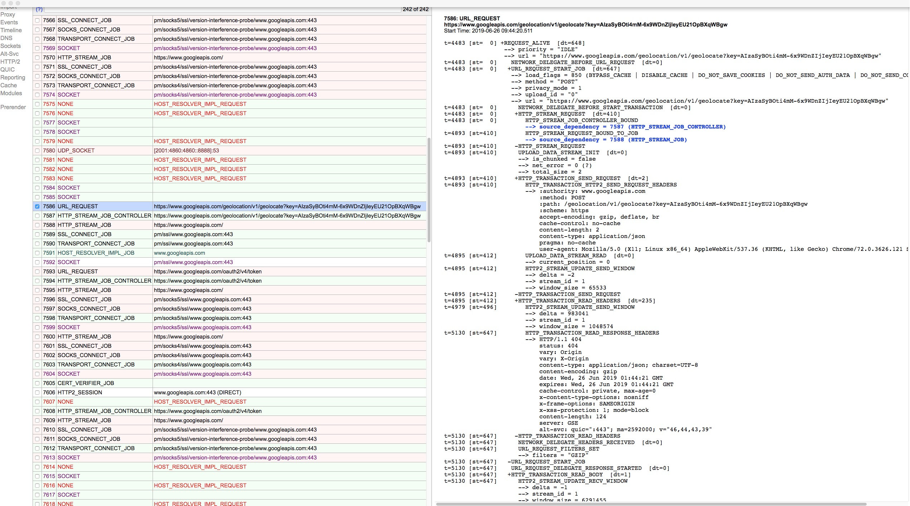
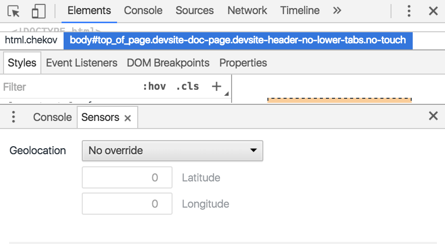
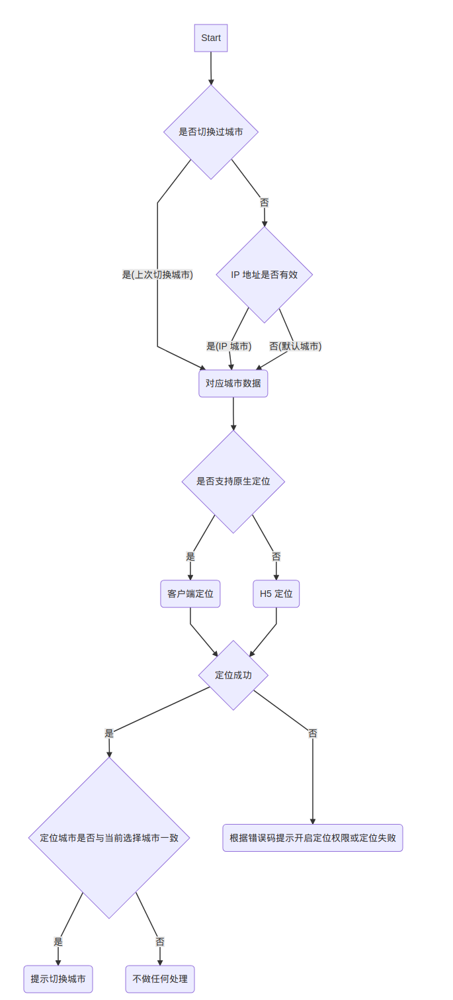

# 前端定位


## 定位原理

Note:
当我们使用 PC 浏览器访问[大众点评](https://www.dianping.com/)时，它能在首页自动显示出你的当前位置并展示该位置附近的美食信息，而我们在使用移动端浏览器访问该网站时，也是一样的，但是会多弹出一个定位授权弹框。这是为什么呢？我都没有对定位进行授权，这些网站也能知道我的当前位置，我的隐私信息是不是泄露了？说起定位，大家耳熟能详的是 GPS（Global Positioning System），中文名叫全球定位系统。最早是美国军方的一个项目，为陆海空三大领域提供实时、全天候和全球性的导航服务。实际上除了 GPS 外，还有基站定位、WiFi 定位、AGPS。


### 基站定位


Note:
基站（手机信号塔）构成一个信号网络，我们要进行通信的时候需要连接到其中一个基站，也就是手机要有信号，此时我们即可在这样一个信号网络里进行通信。我们通过基站位置，设备连接时间、信号强弱以及角度来定位设备的位置。定位速度快，精准度低，100m-1000m，依赖信号塔的密度。


### WiFi 定位



Note:
每一个 Wi-Fi 热点都有一个独一无二的 MAC 地址，智能手机等设备开启 Wi-Fi 后就会自动扫描附近热点并上传它们的地理位置信息，这样就建立了一个庞大的热点位置数据库。反过来讲，如果你的设备连上了某个 Wi-Fi 热点，那么就可以调用服务器或离线数据中附近所有热点的地理位置信息，而服务器会参考每个热点的信号强弱计算出设备的大致地理位置，最后再返回给用户。Wi-Fi 定位精度为 20 米左右。


### GPS 定位



Note:
GPS 定位需要 GPS 硬件支持，直接和卫星交互来获取当前经纬度与准确时间。接收机在户外接收到天上的定位卫星发射出来的信号，得到卫星的位置，推算出接收机到每颗卫星的距离，进而推算出手机的位置。通过GPS方式定位准确度是最高的（10米左右，取决于芯片），但是从GPS模块启动到获取第一次定位数据（冷启动），可能需要比较长的时间，并且 GPS 模块耗电量大，且在室内几乎无法使用。


### AGPS

基站 / Wifi + GPS 定位

Note:
AGPS 利用网络，首先将基站定位或者 WIFI 定位获得的大概位置发到远程服务器，有服务器进行查询和计算，得出这个位置下当前卫星信息，反馈给设备，设备就可以直接用这些信息来接受卫星信号，不用等待漫长的卫星轨道信息广播完毕后，才能知道卫星的位置，大大缩短搜星时间。GPS解决方案的优势主要体现在其定位精度上，在室外等空旷地区，其精度在正常的 GPS 工作环境下，可以达到 10 米左右，堪称目前定位精度最高的一种定位技术。该技术的另一优点为：首次捕获GPS信号的时间一般仅需几秒，不像 GPS 的首次捕获时间可能要 2～3 分钟。


### IP 定位


### 定位对比

| 类型 | 优点 | 缺点 |
| --- | --- | --- |
| 基站 | 定位速度快，手机有网络信号即可 | 精度低 |
| WiFi 定位 | 定位速度块，精度度较好 | 精度不如 GPS |
| GPS 定位 | 定位速度慢，室内不能定位 | 精度高 |
| AGPS 定位 | 精度高，速度较好 | |
| IP 定位 | 定位速度块 | 不一定成功，精度低 |


## 手机定位

Note:
在手机上，除了在定位方案上不同，对于不同的手机系统在定位方面也有不同的处理方式。


### iOS 定位

- 定位方式：基站：Wifi，GPS，AGPS
- 使用方式：iOS API 屏蔽了底层的细节，开发人员不知道是采用哪种方式进行定位。

Note:
iOS 设备能提供 3 种不同途径进行定位：Wi-Fi、蜂窝式移动电话基站、GPS卫星（包括AGPS）。
iOS 不像 Android 系统在定位服务编程时，可以指定采用哪种途径进行定位。iOS的API把底层这些细节屏蔽掉了，开发人员和用户并不知道现在设备是采用哪种方式进行定位的，i OS系统会根据设备的情况和周围的环境，采用一套最佳的解决方案。如果能够接收 GPS 信息，那么设备优先采用 GPS 定位，否则采用 Wi-Fi 或蜂窝基站定位。在 Wi-Fi 和蜂窝基站之间优先使用 Wi-Fi，如果无法连接Wi-Fi 才使用蜂窝基站定位。


### Android 定位

- 定位方式：基站，Wifi，GPS，AGPS
- 使用方式：Android 系统 API 提供基站 ID 和 WIFI 的 MAC 地址获取接口，开发者自行维护基站、MAC 数据库，自行查询推算位置。

Note:
Android 系统 API 提供基站 ID 和 WIFI 的 MAC 地址获取接口，开发者自行维护基站、MAC 数据库，自行查询推算位置。而 GPS 定位信息则可以直接调用系统 API 获得。
除了自行维护数据库之外，也可以使用百度、高德等地图厂商自行实现的定位 SDK。该定位 SDK 的作用就是通过系统接口读取到原始定位信息，然后借助于各家自行部署维护的数据库，查询到当前扫描到的基站、WIFI 的位置，最终计算出更准确的定位结果，通过 SDK 的接口，返回给开发者。


### 定位服务和授权

| | iOS | Android |
| -- | --- | --- |
| 服务 | 支持 | 支持 |
| 权限 | 首次、禁止、允许（分为应用期间和后台） | 询问，禁止，允许 |

Note:
iOS 和 Android 系统都提供了定位服务开关和授权开关，但其中存在一些差异。例如：iOS 的定位服务关闭后所有应用都不能再使用定位服务，而 Android 关闭定位服务只针对 GPS，有授权定位的应用仍然可以使用 WIFI 和基站定位。
此外，iOS 和 Android 定位授权都对应三种状态：允许，禁止，询问（Android）/首次（iOS）。iOS 允许授权的情况还可以按使用场景区分决定是否允许应用在后台定位。


## 坐标信息

- WGS84：GPS 坐标
- GCJ02：国标坐标
- BD09：百度坐标系
- BD09mc：摩卡托坐标

Note:
- WGS84是为GPS全球定位系统使用而建立的坐标系统，最基础的坐标系。
- GCJ02是由中国国家测绘局（G表示Guojia国家，C表示Cehui测绘，J表示Ju局）制订的地理信息系统的坐标系统。它是一种对经纬度数据的加密算法，即加入随机的偏差。国内出版的各种地图系统（包括电子形式），必须至少采用GCJ-02对地理位置进行首次加密。
- 百度基于国标坐标进行加密生成的一套坐标系，百度系的产品都是使用这个坐标系。
- 摩卡托坐标：是一种投影坐标，它不是用经纬度来表示的，等角，多用于航海图、航空图。关于墨卡托可以参考下面这张图片（在地球中心打开一盏灯，光透过球体投射到外面圆柱体上，将这个圆柱体摊开就是投射的地图坐标）。


## H5 定位


### 规范

[Geolocation API](https://dev.w3.org/geo/api/spec-source.html)

> The Geolocation API defines a high-level interface to location information associated only with the device hosting the implementation, such as latitude and longitude. The API itself is agnostic of the underlying location information sources. Common sources of location information include Global Positioning System (GPS) and location inferred from network signals such as IP address, RFID, WiFi and Bluetooth MAC addresses, and GSM/CDMA cell IDs, as well as user input. No guarantee is given that the API returns the device's actual location.




Note:
W3C 只约定了访问位置信息的上层接口规范，浏览器具体实现没有硬性规定，可能是 GPS 定位，基站定位或者 WIFI 定位。例如：PC 端 Chrome 使用 Geolocation API 时，会向 `https://www.googleapis.com/geolocation/v1/geolocate` 发送请求（由于请求被加密过，所以看不出具体内容）。


```
browser=firefox&sensor=true&wifi=mac:xx-xx-xx-xx-xx-xx%7Cssid:xxxxxxx%7Css:-43&wifi=mac:xx-xx-xx-xx-xx-xx%7Cssid:xxxxxxx%7Css:-43&wifi=mac:xx-xx-xx-xx-xx-xx%7Cssid:xxxxxxx%7Css:-43&wifi=mac:xx-xx-xx-xx-xx-xx%7Cssid:xxxxxxx%7Css:-44&wifi=mac:xx-xx-xx-xx-xx-xx%7Cssid:xxxxxxx%7Css:-60&wifi=mac:xx-xx-xx-xx-xx-xx%7Cssid:xxxxxxx%7Css:-61&wifi=mac:xx-xx-xx-xx-xx-xx%7Cssid:xxxxxxx%7Css:-62&wifi=mac:xx-xx-xx-xx-xx-xx%7Cssid:xxxxxxx%7Css:-63&wifi=mac:xx-xx-xx-xx-xx-xx%7Cssid:xxxxxxx%7Css:-63&wifi=mac:xx-xx-xx-xx-xx-xx%7Cssid:xxxxxxx%7Css:-67&wifi=mac:xx-xx-xx-xx-xx-xx%7Cssid:xxxxxxx%7Css:-67&wifi=mac:xx-xx-xx-xx-xx-xx%7Cssid:xxxxxxx%7Css:-67&wifi=mac:xx-xx-xx-xx-xx-xx%7Cssid:xxxxxxx%7Css:-67&wifi=mac:xx-xx-xx-xx-xx-xx%7Cssid:xxxxxxx%7Css:-74&wifi=mac:xx-xx-xx-xx-xx-xx%7Cssid:xxxxxxx%7Css:-82&wifi=mac:xx-xx-xx-xx-xx-xx%7Cssid:xxxxxxx%7Css:-84&wifi=mac:xx-xx-xx-xx-xx-xx%7Cssid:xxxxxxx%7Css:-85
```

Note:
Firefox 使用的也是 Google 服务，但是和 Chrome 用的接口不同（`https://maps.googleapis.com/maps/api/browserlocation/json`），这些数据包含周边 WIFI 设备的 SSID 和 MAC 地址，以及信号强度。


### API

- [Geolocation](https://developer.mozilla.org/en-US/docs/Web/API/Geolocation)

    - [Navigator​.geolocation](https://developer.mozilla.org/en-US/docs/Web/API/Navigator/geolocation)
    - [Geolocation​.get​Current​Position()](https://developer.mozilla.org/en-US/docs/Web/API/Geolocation/getCurrentPosition)
    - [Geolocation​.watch​Position()](https://developer.mozilla.org/en-US/docs/Web/API/Geolocation/watchPosition)
    - [Geolocation​.clear​Watch()](https://developer.mozilla.org/en-US/docs/Web/API/Geolocation/clearWatch)

- [Position​Options](https://developer.mozilla.org/en-US/docs/Web/API/PositionOptions)
- [Position](https://developer.mozilla.org/en-US/docs/Web/API/Position)
- [Coordinates](https://developer.mozilla.org/en-US/docs/Web/API/Coordinates)
- [Position​Error](https://developer.mozilla.org/en-US/docs/Web/API/PositionError)


### 用法


#### 获取位置信息

```js
navigator.geolocation.getCurrentPosition(
    /**
     * @params {Object} position 
     * @params {Object} position.coords 
     * @params {Number} position.coords.latitude 维度
     * @params {Number} position.coords.longitude 经度
     * @params {Number} position.coords.altitude 高度
     * @params {Number} position.coords.accuracy 精度
     * @params {Number} position.coords.altitudeAccuracy 高度精度
     * @params {Number} position.coords.heading 方向
     * @params {Number} position.coords.speed 速度
     * @params {Number} position.timestamp 时间戳 
     */
    function (position) {
    console.log(JSON.stringify(position));
    },
    function (error) {
    console.log(error.code); // 1|PERMISSION_DENIED;2|POSITION_UNAVAILABLE;3|TIMEOUT
    console.log(error.message);
    },
    {
    maximumAge: 0, // 位置缓存有效期
    timeout: 30000, // 超时时间
    enableHighAccuracy: false // 是否高精度
    }
);
```


#### 监听位置

```js
watchID = navigator.geolocation.watchPosition(
    function (position) {
    console.log(JSON.stringify(position));
    },
    function (error) {
    console.log(error.code); // 1|PERMISSION_DENIED;2|POSITION_UNAVAILABLE;3|TIMEOUT
    console.log(error.message);
    },
    {
    maximumAge: 0, // 位置缓存有效期
    timeout: 30000, // 超时时间
    enableHighAccuracy: false // 是否高精度
    }
);
// ---
navigator.geolocation.clearWatch(watchID);
```


### 示例

```js
function toRadians(degree) { 
    return this * Math.PI / 180; 
} 

// 著名的 Haversine 公式
function distance(latitude1, longitude1, latitude2, longitude2) { 
    // R 是地球半径（KM）
    var R = 6371; 

    var deltaLatitude = toRadians(latitude2-latitude1); 
    var deltaLongitude = toRadians(longitude2-longitude1); 
    latitude1 = toRadians(latitude1); 
    latitude2 = toRadians(latitude2); 

    var a = Math.sin(deltaLatitude/2) * 
            Math.sin(deltaLatitude/2) + 
            Math.cos(latitude1) * 
            Math.cos(latitude2) * 
            Math.sin(deltaLongitude/2) * 
            Math.sin(deltaLongitude/2); 

    var c = 2 * Math.atan2(Math.sqrt(a), Math.sqrt(1-a)); 
    var d = R * c; 
    return d; 
}
```

Note:
距离跟踪器：创建一个网页来跟踪从网页被加载的地方到目前所在位置所经过的距离。
- [距离跟踪器](https://www.ibm.com/developerworks/cn/web/1208_wangjian_html5geo/index.html#major7)
- [用 HTML5 Geolocation 实现一个距离追踪器](https://segmentfault.com/a/1190000014210086)


### 问题


1. Geolocation API 必须在 HTTPS 下才能正常调用，在 Chrome 非 HTTPS 域名下调用会直接返回错误码 1 和错误信息 “Only secure origins are allowed”。

Note:
[Geolocation API Removed from Unsecured Origins in Chrome 50](https://developers.google.com/web/updates/2016/04/geolocation-on-secure-contexts-only?hl=zh-cn)


2. 目前 PC 端大部分浏览器使用的是 Google 提供的定位服务，由于 Google 在国内不能正常访问，所以一般请求会超时，返回错误码 3。即使开启了翻墙 VPN，由于 Google 定位服务也一般查不到你的网络设备信息，也就查询不到位置信息，直接返回了错误码 2。




Note:
在 PC 端调试时可以使用 Chrome 的开发者工具来模拟定位信息。


3. iOS 定位是使用系统的定位服务，如果有授权对应网站的话可以正常定位。而 Android 系统的浏览器比较多，依赖浏览器的具体实现，如果也只是用 Google 定位服务的话，也会遇到 PC 端的问题。例如：Android 的 QQ 浏览器，在开启 GPS 服务的时候会使用 GPS 定位，没有开启 GPS 服务会将使用定位授权获得的设备信息发送给 `https://lbs.map.qq.com` 查询当前的位置。


## 定位服务

Note:
H5 Geolocation API 只返回了经纬度信息，无法获得具体的位置信息，如所在的国家和城市信息，这些需要借助第三方的定位服务来实现。目前，国内主要以下三家提供了开发的定位服务：


### 有哪些定位服务？

- [腾讯位置服务](https://lbs.qq.com/tool/component-geolocation.html)
- [百度地图开放平台](http://lbsyun.baidu.com/index.php?title=jspopular/guide/geolocation)
- [高德地图开发平台](https://lbs.amap.com/api/javascript-api/guide/services/geolocation#geolocation)


### 这些定位服务提供了那些功能？

- 逆地址解析(坐标位置描述)
- 地址解析(地址转坐标)
- 地点搜索
- 关键词输入提示
- 行政区划
- 路线规划服务
- 距离计算（一对多）
- 坐标转换
- IP 定位
- ...

Note:
这些定位服务提供了一套完善的工具来协助处理各个应用场景，移动端有定位和地图 SDK，H5 有 JS API 和 地图组件，服务端提供了 WebService API。这些服务大致都提供了以下功能：


## 应用案例

Note
定位功能的一大应用场景就是 LBS，即“基于位置服务”，通过定位服务为用户提供相应服务的一种增值业务。


### 休闲娱乐模式

- 签到：培养用户每到一个地点就会签到（Check-In）的习惯，而它的商业模式也是比较明显，可以很好地为商户或品牌进行各种形式的营销与推广。
- AR 游戏模式：PokeMan Go，一起来捉妖。


### 生活服务模式

- 周边生活服务的搜索：点评网
- 与旅游的结合


### 社交模式

- 地点交友，即时通讯
- 以地理位置为基础的小型社区


## 最佳实践


### 版本1


### 版本2


