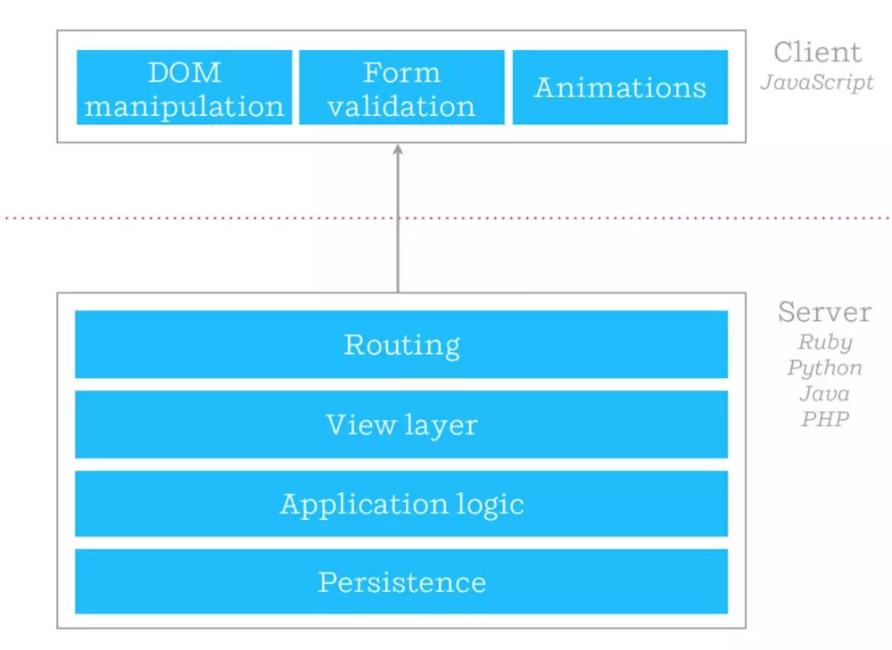

# 同构


## 是什么？


客户端渲染：页面在 JavaScript，CSS 等资源文件加载完毕后开始渲染，路由为客户端路由，也就是我们经常谈到的 SPA（Single Page Application）。


- 服务端渲染：页面由服务端直接返回给浏览器，路由为服务端路由，URL 的变更会刷新页面，原理与 ASP，PHP 等传统后端框架类似。





- 同构：英文表述为 Isomorphic 或 Universal，即编写的 JavaScript 代码可同时运行于浏览器及 Node.js 两套环境中，用服务端渲染来提升首屏的加载速度，首屏之后的路由由客户端控制，即在用户到达首屏后，整个应用仍是一个 SPA。


https://github.com/topics/universal?o=desc&s=stars

https://github.com/topics/isomorphic?o=desc&s=stars


## 为什么？


- SEO：服务端渲染对搜索引擎的爬取有着天然的优势；
- 性能：通过 Node 直出, 将传统的三次串行 HTTP 请求简化成一次 HTTP 请求，降低首屏渲染时间；
- 服务端和客户端维护一份代码就行了。


## 怎么实现？


### 脚手架

- [razzle](https://github.com/jaredpalmer/razzle): Create server-rendered universal JavaScript applications with no configuration
- [react-isomorphic-starterkit](https://github.com/RickWong/react-isomorphic-starterkit): Create an isomorphic React app in less than 5 minutes
- [isomorphic-react-example](https://github.com/DavidWells/isomorphic-react-example): ReactJS + NodeJS ( express ) demo tutorial with video. Universal/Isomorphic JS = Shared JavaScript that runs on both the client & server.


### 集成方案

- [next.js](https://github.com/zeit/next.js): The React Framework
- [nuxt.js](https://github.com/nuxt/nuxt.js): The Vue.js Developers Framework
- [React Server](https://github.com/redfin/react-server): Blazing fast page load and seamless navigation.
- [reactGo](https://github.com/reactGo/reactGo): Your One-Stop solution for a full-stack universal Redux App!
- [beidou](https://github.com/alibaba/beidou): Isomorphic framework for server-rendered React apps


## 存在问题？


### 内存泄露

内存泄漏是指程序中己动态分配的堆内存由于某种原因未释放或无法释放，通常是应用层不合理的逻辑代码引起的。

内存泄漏不是同构应用所特有的，理论上所有服务端应用都可能内存泄漏，但同构应用是“高危群体”。


作用域未释放

```javascript
componentWillMount(){
  let _this = this;
  window.handler = window.setInterval(function(){
    if(typeof AMap){
        _this.renderMap('', AMap);
        window.clearInterval(window.handler);
    }
  }, 300);
}
```


- 避免在 constructor 中做事件绑定，建议放到 componentDidMount 生命周期中
- 不支持SSR的组件放到componentDidMount中，同理，createElement、appendChild等dom原生操作也放到componentDidMount中


### 其他问题

...


## 推荐书籍

- [《React 状态管理与同构实战》](https://book.douban.com/subject/30290509/)
- [《同构 JavaScript 应用开发》](http://www.ituring.com.cn/book/tupubarticle/18356)


# 开发


## 技术选型 —— next.js


- 入学习门槛低
- 面向 react 开发的
- GitHub Start 数量最多
- 用过的人都说好


## 技术架构


## Next.js


### 快速上手

1. `npm install --save next react react-dom`
2. 在 package.json 中添加脚本

    ```json
    {
      "scripts": {
        "dev": "next"
      }
    }
    ```

3. 增加模块 ./pages/index.js

    ```javascript
    export default () => <div>Welcome to next.js!</div>
    ```

4. 运行 `npm run dev` 并访问 `http://localhost:3000`


### 项目结构

```
.
├── .next
├── pages
├── static
└── vendors
├── next.config.js
├── package.json
└── README.md
```


```
.
├── build-manifest.json
├── react-loadable-manifest.json
├── server
│   ├── pages-manifest.json
│   ├── ssr-module-cache.js
│   └── static
│       └── development
│           └── pages
│               ├── _app.js
│               ├── _document.js
│               ├── _error.js
│               └── index.js
└── static
    ├── chunks
    ├── development
    │   ├── dll
    │   └── pages
    │       ├── _app.js
    │       ├── _error.js
    │       └── index.js
    ├── runtime
    │   ├── main.js
    │   └── webpack.js
    └── webpack
        ├── f4da49f708868023346e.hot-update.json
        └── styles.f4da49f708868023346e.hot-update.js
```


## next-mobile


### next.config.js

```
const withMobile = require('next-mobile');
module.exports = withMobile();
```


### 默认配置

```javascript
{
  distDir: '.next/production', // 构建输出路径
  assetPrefix: '', // 静态资源前缀
  inlineImageLimit: 8192, // 图片资源大小限制
  cssLocalIdentName: '[hash:base64:5]', // CSS Module 命名方式
  native: {}, // webpack 定制配置
  env: { // 环境变量特殊配置
    development: {
      distDir: '.next/development',
      inlineImageLimit: 1,
      cssLocalIdentName: '[local]-[hash:base64:5]',
    },
  },
}
```


### .browserslistrc

```
node 6
iOS >= 8
Android >= 4.4
last 2 QQAndroid versions
```


## next-router


...


## [@meetyou/react-hybrid](http://192.168.3.98:3000/)


- 基于优秀的开源组件库二次开发

    - react-native-web
    - antd design mobile

- UI 组件符合美柚 UED 设计稿规范
- 提供常用的工具函数


## 示例图


## 图片

- 选择正确的图片格式
- 根据设备调整调整分辨率
- 图片懒加载


```javascript
import { Image } from '@meetyou/react-hybrid';

<Image
  lazy
  source={{
    uri: data.xxx,
    width: 100,
    height: 100,
    webp: true,
  }}
/>
```


## 无限列表

- ListView
- FlatList

    - DOM 回收
    - 占位图
    - 滚动锚定


## 状态管理

...


## 项目结构


```
.
├── next.config.js
├── package.json
├── package-lock.json
├── README.md
├── server.js
└── src
    ├── components
    ├── constants
    ├── models
    ├── pages
    ├── services
    ├── static
    ├── store.js
    ├── styles
    └── vendors
```


## 项目集成


### 旧项目

...


### 新项目

1. `npm install @meetyou/create-my-next -g --registry=http://registry.cnpm.seeyouyima.com`
2. `create-my-next <project-directory>`
